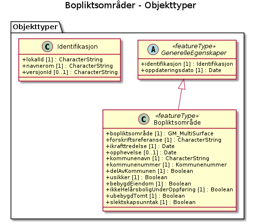

# Produktspesifikasjon: Bopliktsområder

## Innledning, historikk og endringslogg

### Innledning

### Historikk

### Endringslogg

### Normative referanser

## Definisjoner og forkortelser

### Definisjoner

### Forkortelser

## Generelt om spesifikasjonen

### Unik identifisering

49415185-d99f-4546-b976-18cfbf167827

#### Fullstendig navn

Bopliktsområder

#### Versjon

2025-12-11

### Referansedato

2025-12-11

### Ansvarlig organisasjon

Kartverket

### Språk

nor

### Hovedtema

### Temakategori

### Sammendrag

### Formål

## Spesifikasjonsomfang

**Nivå**: dataset

**Utstrekning**:

- **tidsmessig**: - **intervall**: - 2025-12-11, 2025-12-11

**Juridiske begrensninger**:

- **Tilgangsbegrensninger**: Åpne data
- **Bruksbegrensninger**: Lisens
- **Lisens**: No conditions apply to access and use
- **Lisenslenke**: <http://inspire.ec.europa.eu/metadata-codelist/ConditionsApplyingToAccessAndUse/noConditionsApply>

## Innhold og struktur

### Datamodell

#### Bopliktsområde

Geometri:
- type: GM_MultiSurface

Egenskaper

<table class="feature-attribute-table">
  <colgroup>
    <col style="width: 35%;" />
    <col style="width: 65%;" />
  </colgroup>
  <tbody>
    <tr>
      <th scope="row">Navn:</th>
      <td><strong>geometry</strong></td>
    </tr>
    <tr>
      <th scope="row">Type:</th>
      <td>GM_MultiSurface</td>
    </tr>
    <tr>
      <th scope="row">OGC-rolle:</th>
      <td>primary-geometry</td>
    </tr>
  </tbody>
</table>

<table class="feature-attribute-table">
  <colgroup>
    <col style="width: 35%;" />
    <col style="width: 65%;" />
  </colgroup>
  <tbody>
    <tr>
      <th scope="row">Navn:</th>
      <td><strong>forskriftsreferanse</strong></td>
    </tr>
    <tr>
      <th scope="row">Multiplisitet:</th>
      <td>1</td>
    </tr>
    <tr>
      <th scope="row">Type:</th>
      <td>CharacterString</td>
    </tr>
  </tbody>
</table>

<table class="feature-attribute-table">
  <colgroup>
    <col style="width: 35%;" />
    <col style="width: 65%;" />
  </colgroup>
  <tbody>
    <tr>
      <th scope="row">Navn:</th>
      <td><strong>ikrafttredelse</strong></td>
    </tr>
    <tr>
      <th scope="row">Multiplisitet:</th>
      <td>1</td>
    </tr>
    <tr>
      <th scope="row">Type:</th>
      <td>Date</td>
    </tr>
  </tbody>
</table>

<table class="feature-attribute-table">
  <colgroup>
    <col style="width: 35%;" />
    <col style="width: 65%;" />
  </colgroup>
  <tbody>
    <tr>
      <th scope="row">Navn:</th>
      <td><strong>opphevelse</strong></td>
    </tr>
    <tr>
      <th scope="row">Multiplisitet:</th>
      <td>0..1</td>
    </tr>
    <tr>
      <th scope="row">Type:</th>
      <td>Date</td>
    </tr>
  </tbody>
</table>

<table class="feature-attribute-table">
  <colgroup>
    <col style="width: 35%;" />
    <col style="width: 65%;" />
  </colgroup>
  <tbody>
    <tr>
      <th scope="row">Navn:</th>
      <td><strong>kommunenavn</strong></td>
    </tr>
    <tr>
      <th scope="row">Multiplisitet:</th>
      <td>1</td>
    </tr>
    <tr>
      <th scope="row">Type:</th>
      <td>CharacterString</td>
    </tr>
  </tbody>
</table>

<table class="feature-attribute-table">
  <colgroup>
    <col style="width: 35%;" />
    <col style="width: 65%;" />
  </colgroup>
  <tbody>
    <tr>
      <th scope="row">Navn:</th>
      <td><strong>kommunenummer</strong></td>
    </tr>
    <tr>
      <th scope="row">Multiplisitet:</th>
      <td>1</td>
    </tr>
    <tr>
      <th scope="row">Type:</th>
      <td>Kommunenummer</td>
    </tr>
    <tr>
      <th scope="row">Tillatte verdier:</th>
      <td>- Kodeliste: <a href="https://register.geonorge.no/sosi-kodelister/inndelinger/inndelingsbase/kommunenummer">https://register.geonorge.no/sosi-kodelister/inndelinger/inndelingsbase/kommunenummer</a></td>
    </tr>
  </tbody>
</table>

<table class="feature-attribute-table">
  <colgroup>
    <col style="width: 35%;" />
    <col style="width: 65%;" />
  </colgroup>
  <tbody>
    <tr>
      <th scope="row">Navn:</th>
      <td><strong>delAvKommunen</strong></td>
    </tr>
    <tr>
      <th scope="row">Multiplisitet:</th>
      <td>1</td>
    </tr>
    <tr>
      <th scope="row">Type:</th>
      <td>Boolean</td>
    </tr>
  </tbody>
</table>

<table class="feature-attribute-table">
  <colgroup>
    <col style="width: 35%;" />
    <col style="width: 65%;" />
  </colgroup>
  <tbody>
    <tr>
      <th scope="row">Navn:</th>
      <td><strong>usikker</strong></td>
    </tr>
    <tr>
      <th scope="row">Multiplisitet:</th>
      <td>1</td>
    </tr>
    <tr>
      <th scope="row">Type:</th>
      <td>Boolean</td>
    </tr>
  </tbody>
</table>

<table class="feature-attribute-table">
  <colgroup>
    <col style="width: 35%;" />
    <col style="width: 65%;" />
  </colgroup>
  <tbody>
    <tr>
      <th scope="row">Navn:</th>
      <td><strong>bebygdEiendom</strong></td>
    </tr>
    <tr>
      <th scope="row">Multiplisitet:</th>
      <td>1</td>
    </tr>
    <tr>
      <th scope="row">Type:</th>
      <td>Boolean</td>
    </tr>
  </tbody>
</table>

<table class="feature-attribute-table">
  <colgroup>
    <col style="width: 35%;" />
    <col style="width: 65%;" />
  </colgroup>
  <tbody>
    <tr>
      <th scope="row">Navn:</th>
      <td><strong>ikkeHelårsboligUnderOppføring</strong></td>
    </tr>
    <tr>
      <th scope="row">Multiplisitet:</th>
      <td>1</td>
    </tr>
    <tr>
      <th scope="row">Type:</th>
      <td>Boolean</td>
    </tr>
  </tbody>
</table>

<table class="feature-attribute-table">
  <colgroup>
    <col style="width: 35%;" />
    <col style="width: 65%;" />
  </colgroup>
  <tbody>
    <tr>
      <th scope="row">Navn:</th>
      <td><strong>ubebygdTomt</strong></td>
    </tr>
    <tr>
      <th scope="row">Multiplisitet:</th>
      <td>1</td>
    </tr>
    <tr>
      <th scope="row">Type:</th>
      <td>Boolean</td>
    </tr>
  </tbody>
</table>

<table class="feature-attribute-table">
  <colgroup>
    <col style="width: 35%;" />
    <col style="width: 65%;" />
  </colgroup>
  <tbody>
    <tr>
      <th scope="row">Navn:</th>
      <td><strong>slektskapsunntak</strong></td>
    </tr>
    <tr>
      <th scope="row">Multiplisitet:</th>
      <td>1</td>
    </tr>
    <tr>
      <th scope="row">Type:</th>
      <td>Boolean</td>
    </tr>
  </tbody>
</table>

Relasjoner

**Arv**
GenerelleEgenskaper

#### GenerelleEgenskaper (abstrakt)

Egenskaper

<table class="feature-attribute-table">
  <colgroup>
    <col style="width: 35%;" />
    <col style="width: 65%;" />
  </colgroup>
  <tbody>
    <tr>
      <th scope="row">Navn:</th>
      <td><strong>identifikasjon</strong></td>
    </tr>
    <tr>
      <th scope="row">Definisjon:</th>
      <td>unik identifikasjon av et objekt</td>
    </tr>
    <tr>
      <th scope="row">Multiplisitet:</th>
      <td>1</td>
    </tr>
    <tr>
      <th scope="row">Type:</th>
      <td>Identifikasjon</td>
    </tr>
  </tbody>
</table>

<table class="feature-attribute-table">
  <colgroup>
    <col style="width: 35%;" />
    <col style="width: 65%;" />
  </colgroup>
  <tbody>
    <tr>
      <th scope="row">Navn:</th>
      <td><strong>identifikasjon.lokalId</strong></td>
    </tr>
    <tr>
      <th scope="row">Definisjon:</th>
      <td>lokal identifikator av et objekt  Merknad: Det er dataleverendørens ansvar å sørge for at den lokale identifikatoren er unik innenfor navnerommet.</td>
    </tr>
    <tr>
      <th scope="row">Multiplisitet:</th>
      <td>1</td>
    </tr>
    <tr>
      <th scope="row">Type:</th>
      <td>CharacterString</td>
    </tr>
  </tbody>
</table>

<table class="feature-attribute-table">
  <colgroup>
    <col style="width: 35%;" />
    <col style="width: 65%;" />
  </colgroup>
  <tbody>
    <tr>
      <th scope="row">Navn:</th>
      <td><strong>identifikasjon.navnerom</strong></td>
    </tr>
    <tr>
      <th scope="row">Definisjon:</th>
      <td>navnerom som unikt identifiserer datakilden til et objekt, anbefales å være en http-URI  Eksempel: <a href="http://data.geonorge.no/SentraltStedsnavnsregister/1.0">http://data.geonorge.no/SentraltStedsnavnsregister/1.0</a>  Merknad : Verdien for nanverom vil eies av den dataprodusent som har ansvar for de unike identifikatorene og må være registrert i data.geonorge.no eller data.norge.no</td>
    </tr>
    <tr>
      <th scope="row">Multiplisitet:</th>
      <td>1</td>
    </tr>
    <tr>
      <th scope="row">Type:</th>
      <td>CharacterString</td>
    </tr>
  </tbody>
</table>

<table class="feature-attribute-table">
  <colgroup>
    <col style="width: 35%;" />
    <col style="width: 65%;" />
  </colgroup>
  <tbody>
    <tr>
      <th scope="row">Navn:</th>
      <td><strong>identifikasjon.versjonId</strong></td>
    </tr>
    <tr>
      <th scope="row">Definisjon:</th>
      <td>identifikasjon av en spesiell versjon av et geografisk objekt (instans)</td>
    </tr>
    <tr>
      <th scope="row">Multiplisitet:</th>
      <td>0..1</td>
    </tr>
    <tr>
      <th scope="row">Type:</th>
      <td>CharacterString</td>
    </tr>
  </tbody>
</table>

<table class="feature-attribute-table">
  <colgroup>
    <col style="width: 35%;" />
    <col style="width: 65%;" />
  </colgroup>
  <tbody>
    <tr>
      <th scope="row">Navn:</th>
      <td><strong>oppdateringsdato</strong></td>
    </tr>
    <tr>
      <th scope="row">Definisjon:</th>
      <td>tidspunkt for siste endring på objektet  Merknad: Oppdateringsdato kan være forskjellig fra datafangsdato ved at data som er registrert kan bufres en kortere eller lengre periode før disse legges inn i datasystemet (databasen).</td>
    </tr>
    <tr>
      <th scope="row">Multiplisitet:</th>
      <td>1</td>
    </tr>
    <tr>
      <th scope="row">Type:</th>
      <td>DateTime</td>
    </tr>
  </tbody>
</table>

## Referansesystem

## Kvalitet

**Nivå**: dataset

## Datafangst

## Datavedlikehold

**Vedlikeholdsfrekvens**: Etter behov

## Presentasjon

## Leveranse

## Metadata

**Standard**: ISO19115

**Standardversjon**: 2003

**Metadatadato**: 2026-01-05

**språk**: nor

**Kontaktpunkt**:

- **organisasjon**: Kartverket
- **epost**: kundesenter@kartverket.no
- **rolle**: pointOfContact

**Identifikatorer**:

- **Utsteder**: geonorge
  **kode**: 49415185-d99f-4546-b976-18cfbf167827

**Metadatalenke**:
<https://www.geonorge.no/geonetwork/srv/nor/csw?service=CSW&request=GetRecordById&version=2.0.2&outputSchema=http://www.isotc211.org/2005/gmd&elementSetName=full&id=49415185-d99f-4546-b976-18cfbf167827>
